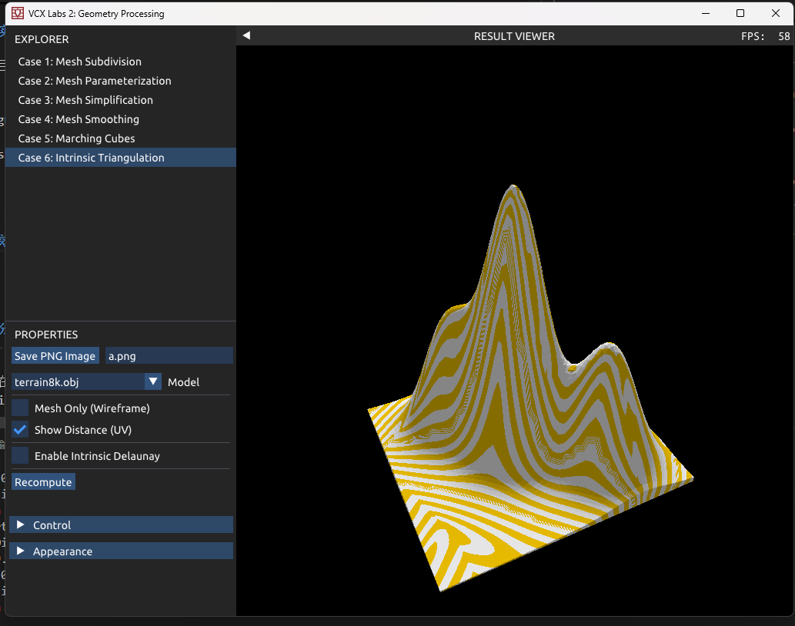
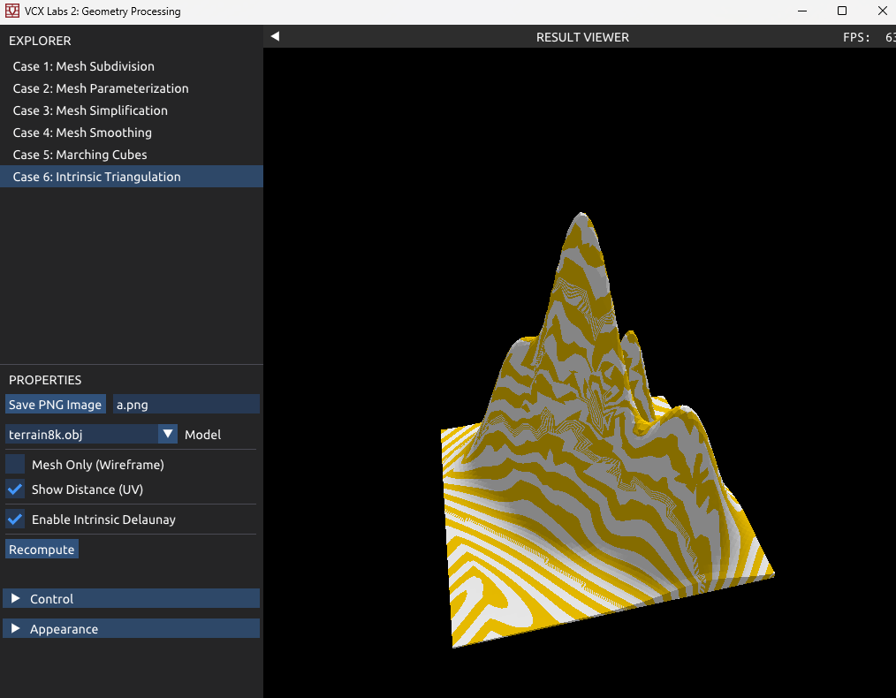

# 基于内蕴三角剖分的测地线距离场计算优化

## 1. 项目概述 (Project Overview)

在计算机图形学与几何处理领域，三角网格（Triangle Mesh）的质量直接决定了数值算法的稳定性与精度。现实应用中获取的网格模型往往包含大量“病态”（ill-conditioned）三角形——即角度极小或极大的细长三角形。这些劣质单元会导致离散拉普拉斯算子（Discrete Laplacian）的性质恶化，进而引发数值计算误差，表现为计算结果的伪影、震荡或完全失真。

本项目复现了 SIGGRAPH 2020 相关论文的核心思想，通过**内蕴三角剖分（Intrinsic Triangulations）**技术，特别是**内蕴边翻转（Intrinsic Edge Flipping）**算法，在不改变网格几何形状（Geometry）的前提下优化其连接关系（Connectivity）。本项目以**热扩散法（Heat Method）**计算测地线距离场为例，对比了原始网格与经过内蕴 Delaunay 优化后的网格在数值计算上的表现，验证了内蕴三角剖分在处理劣质网格时的有效性与鲁棒性。

## 2. 理论基础 (Theoretical Background)

### 2.1 热扩散法 (The Heat Method)
热扩散法是一种求解曲面上测地线距离的高效算法。其核心思想利用了热流在短时间内的传播特性与测地距离之间的渐近关系。算法包含三个步骤：
1.  **热扩散（Heat Diffusion）**：求解热传导方程 $\Delta u = \frac{\partial u}{\partial t}$。在离散网格上，这转化为求解线性方程组 $(M - t L_C) u = \delta_{\gamma}$，其中 $M$ 为质量矩阵，$L_C$ 为余切拉普拉斯矩阵（Cotan Laplacian）。
2.  **梯度计算与归一化（Gradient Computation & Normalization）**：计算温度场 $u$ 的梯度 $\nabla u$，并将其归一化得到单位向量场 $X = -\frac{\nabla u}{|\nabla u|}$。
3.  **泊松方程求解（Poisson Equation）**：求解 $\Delta \phi = \nabla \cdot X$ 恢复距离场 $\phi$。

### 2.2 内蕴边翻转 (Intrinsic Edge Flipping)
内蕴三角剖分的核心在于将网格的“形状”与“连接关系”解耦。我们维护一个与原始网格等距同构（Isometric）的内蕴网格。
*   **操作定义**：对于两个共享边 $e$ 的三角形 $(i, j, k)$ 和 $(j, i, l)$，边翻转操作将公共边 $e_{ij}$ 替换为连接对角顶点的新边 $e_{kl}$。
*   **几何不变性**：在内蕴视角下，翻转后的新边 $e_{kl}$ 是沿着原始曲面的测地线段。虽然网格的拓扑连接改变了，但其表示的曲面几何（曲率、度量）保持不变。

### 2.3 为什么翻转有效？ (Why Flipping Works?)
从理论角度，Delaunay 三角剖分具有以下关键性质，使其对几何处理至关重要：
1.  **最大化最小角**：Delaunay 剖分避免了极细长的三角形，从而改善了有限元插值的条件数。
2.  **保证余切权重非负**：对于离散拉普拉斯算子 $L_{ij} = \frac{1}{2}(\cot \alpha_{ij} + \cot \beta_{ij})$，Delaunay 条件保证了所有 $\alpha + \beta \le \pi$，即 $\cot \alpha + \cot \beta \ge 0$。
    *   **最大值原理（Maximum Principle）**：非负的边权重保证了拉普拉斯矩阵是 M-矩阵（M-matrix）。这在物理上意味着热量不会从低温流向高温，从而避免了数值解中出现非物理的震荡（伪影）。
    *   **收敛性**：Delaunay 翻转算法（不断翻转不满足 Delaunay 条件的边）被证明在有限步内收敛。

## 3. 系统实现 (Implementation)

本项目基于课程 Lab2 框架开发，新增 `CaseIntrinsicTriangulation` 模块。

### 3.1 数据结构与初始化
*   **网格加载**：通过 `IntrinsicContent` 模块加载 `.obj` 模型，构建半边数据结构（DCEL）。
*   **内蕴数据管理**：引入 `IntrinsicData` 结构体，独立存储每条半边的长度 `edge_length`。初始状态下，内蕴边长等于原始网格的欧氏边长。
*   **双重表示**：系统同时维护两套数据：
    1.  原始网格拓扑 $G$ 及对应的边长数据。
    2.  经过 Delaunay 优化后的网格拓扑 $G^*$ 及更新后的边长数据。

### 3.2 内蕴 Delaunay 翻转算法
在 `tasks.cpp` 中实现了基于贪心策略的翻转算法：
1.  **Delaunay 条件检测**：遍历网格所有内部边，计算其对角角度之和。利用余弦定理，判定条件等价于检查 $\cot \alpha + \cot \beta < 0$。
2.  **拓扑修改**：若边不满足 Delaunay 条件，执行 `FlipEdge` 操作。
    *   **拓扑重连**：在 DCEL 中重新分配半边的 `Next`、`Twin` 和 `Vertex` 指针，确保局部拓扑正确更新。
    *   **几何更新**：利用平面几何公式计算新对角边的长度：
        $$ \ell_{new}^2 = \frac{\ell_{ik}^2 \ell_{jl}^2 + \ell_{il}^2 \ell_{jk}^2 - 2 \ell_{ij}^2 \ell_{ik} \ell_{jl} \cos(\theta_{i} + \theta_{j})}{\ell_{ij}^2} $$
        （注：实际实现中使用了基于 Ptolemy 不等式或余弦定理的等价形式计算新边长）。
3.  **迭代收敛**：重复上述过程并使用队列维护可能需要翻转的边，直至所有边均满足 Delaunay 条件。

### 3.3 数值计算层：热扩散法
在 `DistanceMap` 函数中实现了热扩散法，关键改进在于适配内蕴数据：
*   **拉普拉斯矩阵构建**：使用优化后的内蕴边长计算余切权重。由于经过了 Delaunay 翻转，所有权重保证非负。
*   **质量矩阵与梯度**：所有面积、梯度及散度计算均基于更新后的内蕴几何量（边长），而非原始顶点坐标。

## 4. 实验结果与分析 (Results & Analysis)

### 4.1 实验设置
*   **测试模型**：`terrain8k.obj`，一个包含大量细长三角形的地形网格，具有典型的劣质几何特征。
*   **可视化方案**：使用周期性颜色映射（条纹图案）来直观展示距离场的等值线分布。

### 4.2 结果对比

| 场景 | 原始网格 (Original Mesh) | 内蕴 Delaunay 优化网格 (Intrinsic Delaunay Mesh) |
| :--- | :--- | :--- |
| **可视化结果** |  |  |
| **现象描述** | 等值线呈现严重的锯齿状、断裂和不规则扭曲。在山峰陡峭区域，距离场数值出现明显的非物理震荡。 | 等值线变得平滑、连续，且分布均匀。距离场准确反映了地形的测地距离结构，消除了大部分数值伪影。 |

### 4.3 误差分析
*   **原始网格的问题**：如图所示，原始结果中的伪影主要源于非 Delaunay 三角剖分导致的负余切权重。这破坏了热扩散方程的单调性，使得热量传播方向出现偏差，进而导致梯度计算错误。
*   **优化的有效性**：经过 Intrinsic Flipping 后，网格满足了 Delaunay 性质。虽然顶点位置未变，但逻辑连接的改变修正了拉普拉斯算子，使其恢复了 M-矩阵性质，从而保证了热扩散过程的数值稳定性。

### 4.4 局限性讨论
尽管优化后的结果在数值上更准确，但在可视化上仍存在细微的锯齿（与 Tutorial 的 Benchmark 相比）。
*   **原因**：本项目目前的实现仅更新了网格的拓扑连接（Connectivity）和边长数据，但在最终渲染时，计算出的距离值 $\phi$ 依然被赋值给原始网格的顶点，并基于原始的长条形三角形进行线性插值（Linear Interpolation）。
*   **差异来源**：Tutorial 中的高平滑度结果通常采用了纹理空间插值或将内蕴网格显式地切割并展平（Common Subdivision），从而在渲染端也利用了优化后的几何结构。本项目受限于渲染管线，仅展示了顶点级数据的改善，尚未包含渲染级的插值优化。

## 5. 结论 (Conclusion)

本项目成功实现了基于内蕴三角剖分的网格优化算法。实验表明，对于劣质网格，直接应用几何处理算法会导致严重的数值误差；而通过内蕴边翻转将网格优化为 Delaunay 三角剖分后，能够显著修复拉普拉斯算子的缺陷，大幅提高热扩散法计算测地线距离的准确性与鲁棒性。这一技术为处理低质量几何数据提供了一种无需重网格化（Remeshing）的高效解决方案。

