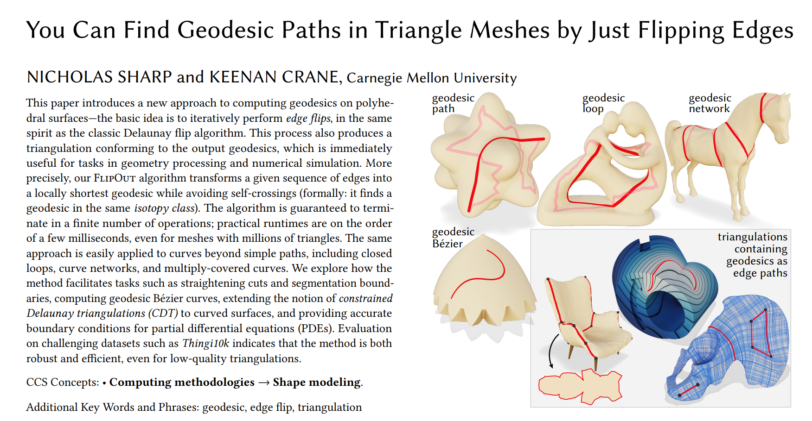

## 期末大项目

3. You Can Find Geodesic Paths in Triangle Meshes by Just Flipping Edges (⭐⭐⭐)

这是一篇 SIGGRAPH 2020 上的 [[https://nmwsharp.com/media/papers/flip-geodesics/flip_geodesics.pdf|文章]] ，属于 Intrinsic Triangulations 的一系列文章之一。当几何物体表面的三角形比较均匀时，我们在上面进行一些几何处理（比如表面参数化、拉普拉斯光滑等）往往能得到比较好的效果。但是现实中的三角形网格可能有大量的ill-condition 的三角形：

比如上图中有非常多细长的三角形，这会导致几何处理的结果出现不自然的结果。Intrinsic Triangulations 解决的就是如何在这样的三角形网格上做各种几何处理的问题。作者在 SIGGRAPH 上关于 Intrinsic Triangulations 做了一次非常详细的 [[https://www.youtube.com/watch?v=gcRDdYrgOhg|入门教程]] ，同时配有开源代码。你可以首先学习这个教程，阅读 paper 理解算法的原理，然后尝试复现论文中的算法。
