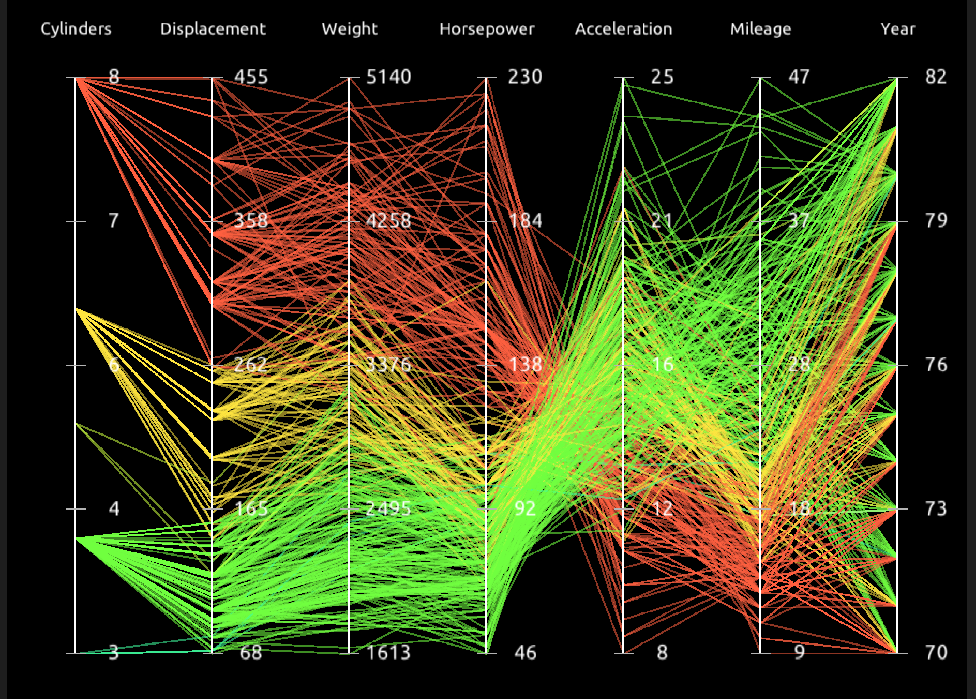
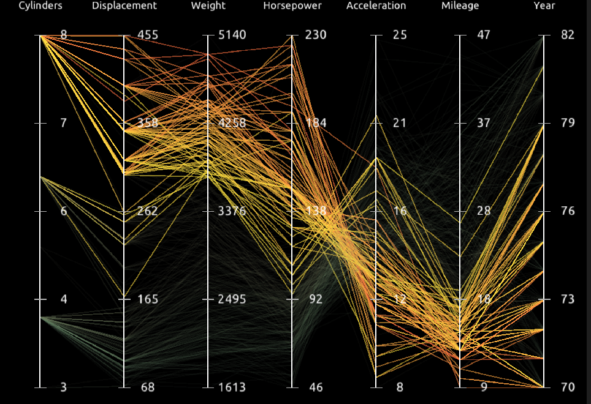
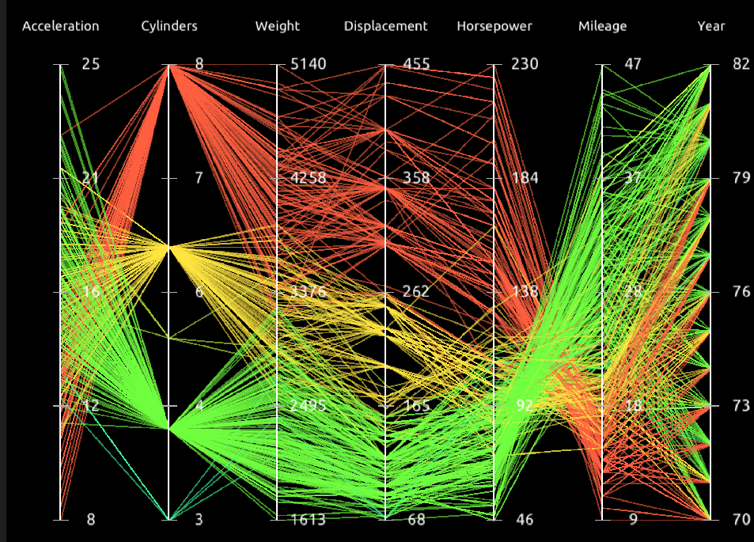
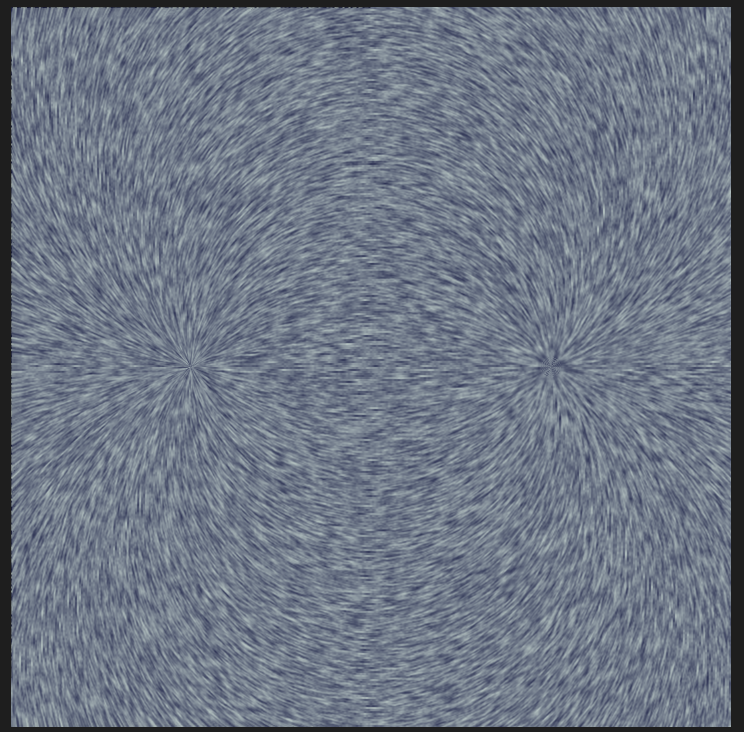
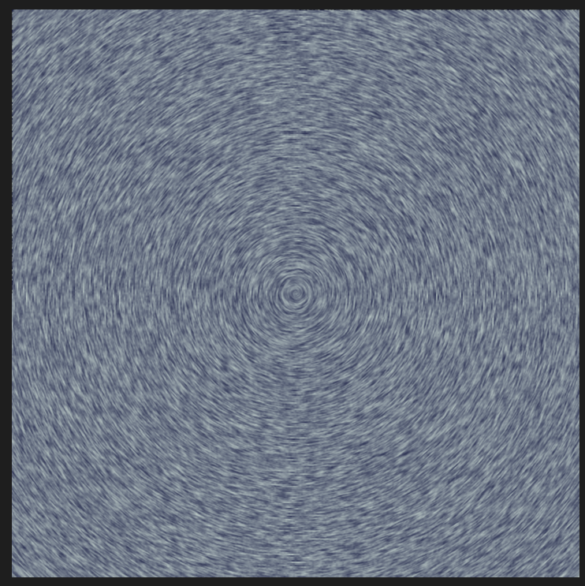
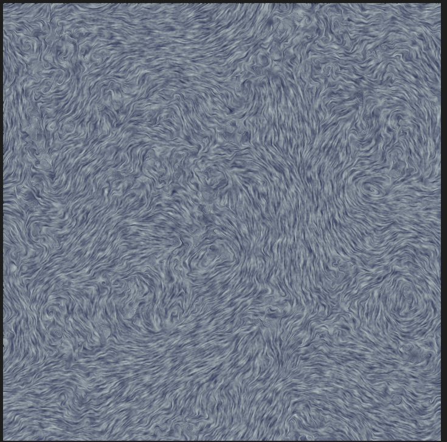

## Task1 平行坐标轴可视化

不同数据维度放在相互平行的坐标轴上，可以表现两个相邻坐标轴之间的依赖关系，然而其他的坐标轴组合的关系则难以观察，因而使用其他信息来可视化。

支持的功能：

1. 选择一个坐标轴，按照数据在这一维的值进行染色，可以大致观测与非相邻维度的关系。

2. 拖动覆盖坐标轴上的一段区域，保留这一段上的折线（数据点），其余数据半隐藏状态，用以突出显示某一组数据的关系。

3. 拖动交换坐标轴。由于API没有关于鼠标按下/松开的事件，Ondragging只有在按下同时移动时激活，难以做到同时保留和更新状态。功能比较受限。目前采用的方法是记录上一次交换的两次坐标轴，并且要求两次相邻的交换不同坐标轴。这样即使拖动过程移动断断续续也能维持切换后的状态而不是频闪。缺点是移动无法撤销只能反向再进行一次交换，并且一次只能进行一次相邻的交换。

## Task2 LIC流场可视化

利用噪声图提供随机性，通过把噪点出的流向以卷积方法“涂”在图像上来表现2维流场的方向。

对于每个像素，用显式欧拉方法积分得到其前、后的方向。由于我们并不关心实际的流动速度，因此可以对插值得到的速度进行归一化，避免速度过大带来的误差和速度太小导致的随机性明显。

